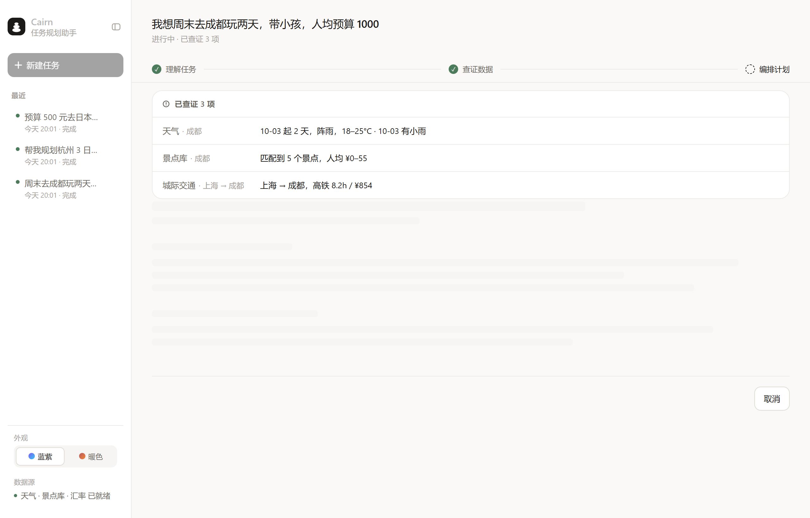

# Cairn · 任务规划助手

> 把一句"我想周末去成都玩两天"变成一份**有序、可执行、带依赖关系**的行动计划。
>   
> 一个基于 **MCP 协议**的工具调用 Agent，会自己查天气、翻景点库、算交通，缺数据时如实说而不是编。

**Cairn** <u>kern</u> —— 徒步时用石头堆起的路标。名字取自它和这个项目的三处同构：
  
**一块一块垒起来**（每个事实都经工具查证后才写进计划）、
  
**只用手里真有的石头**（查不到就说查不到，绝不编造）、
  
立在**不熟悉的地形**里（任务越模糊，越要先澄清再规划）。


---

## 这是什么

给它一句自然语言任务，它调用工具取证，然后产出一份结构化计划：

```
阶段(phase) → 步骤(step) → 动作(action) → 工具(tool) → 前置依赖(depends_on)
           → 预估耗时(eta) → 产出物(deliverable) → 验收标准(done_when)
```

同时输出 **Markdown 人类可读版** 和 **JSON 机器可解析版**，后者带依赖图校验（必须无环）。

它**只做规划，不做执行**——不订票、不付款、不发消息。

---

## Demo

### 网页版

<table>
  
<tr>
  
<td width="50%">

**① 输入需求**


</td>
  
<td width="50%">

**② 实时进度**

用户能看到 Agent 正在查什么、花了多久 —— 而不是盯着一个转圈等 30 秒。



</td>
  
</tr>
  
<tr>
  
<td width="50%">

**③ 结构化计划**

阶段 → 步骤 → 依赖 → 数据来源，一眼看清哪些步骤能并行。


</td>
  
<td width="50%">

**④ 澄清提问**

信息不足时暂停并提问，而不是硬猜。回答后自动恢复。


</td>
  
</tr>
  
</table>

### 命令行

真实运行（DeepSeek `deepseek-chat`），无任何剪辑：

```console
$ uv run task-planner "我想周末去成都玩两天，带小孩，人均预算 1000" -v
  · 第 1 轮：请求模型
  · 模型请求 2 次工具调用
  · ✅ get_weather_forecast (1435ms / 1 次尝试)
  · ✅ query_attractions_db (31ms / 1 次尝试)
  · 第 2 轮：请求模型
  · 模型给出最终回复

📋 计划（人类可读版）
# 成都周末亲子两日游 · 执行计划

**行程日期**：2026-10-03（周六）～ 2026-10-04（周日）
**天气实况（已查证）**：10-03 阵雨 17.8~25.3℃、降水概率 51%；
10-04 毛毛雨 17.5~20.8℃、降水概率 71%。
**两天降水概率均≥50%，必须准备室内备选方案**。

## 阶段一：行前准备
| 步骤 | 具体动作 | 工具 | 前置依赖 | 耗时 | 产出物 |
|---|---|---|---|---|---|
| S1 | 确认出行人数与儿童年龄，锁定总预算 | null | — | 0.2h | 人数/预算确认单 |
| S2 | 查询并记录成都天气，判定雨天备选 | get_weather_forecast | — | 0.2h | 天气结论 |
| S3 | 筛选亲子景点并排序 | query_attractions_db | — | 0.3h | 候选景点清单 |
...
| S11 | **Day2 上午（雨天主选）**：四川科技馆（免费，3h） | null | S2 | 3h | 游览记录 |
...

依赖图校验：✅ 无环
引用工具：estimate_route, get_weather_forecast, parse_budget_csv,
         query_attractions_db, save_itinerary

🔍 运行轨迹
[成功] 轮次=2 工具调用=2 (失败 0) 预算=2/12 停止原因=model_finished
  ✅ get_weather_forecast 1435ms
  ✅ query_attractions_db 31ms
```

注意它做的几件事：把"周末"**自己推算**成 `2026-10-03/04`（没反问用户）、
  
**真实调用**天气接口、发现两天降水概率都超 50% 后**主动切换室内方案**、
  
并且每个含事实的步骤都标了 `data_source`。

### 缺数据时它会说实话

```console
$ uv run task-planner "帮我规划这周末去雷克雅未克玩三天"
  ✅ get_weather_forecast  1258ms   ← 解析为「雷克雅未克 / 冰岛」
  ❌ NOT_FOUND query_attractions_db  ← 景点库不覆盖该城市

⚠️ **数据缺失**：本地景点库不覆盖雷克雅未克（当前覆盖 305 城：中国 255 城
+ 海外 50 城），因此**无法提供景点清单与票价**。
计划中涉及具体景点的部分需你自行核实或改用官方渠道查询。
```

工具失败不会中断流程，Agent 继续用其他工具完成计划，并明确标注缺口——
  
**不编造景点、票价或坐标**。

---

## 核心特性

- **10 个功能互异的工具** —— 天气 API、网页抓取、SQLite 景点库、CSV 解析、汇率换算、
    
  城际交通估算、实时公交换乘、实时景点核对、文件落盘、用户澄清
- **MCP 协议桥接** —— 工具以标准 MCP Server（stdio / JSON-RPC）暴露，
    
  同时保留 LLM 原生 function calling 作为降级通道
- **单一 Schema 来源** —— 工具的 Pydantic 模型同时生成 MCP `inputSchema` 与
    
  LLM `tools` 参数，有测试断言两者逐字节一致
- **6 条运行时护栏** —— 轮次上限、工具预算、幂等去重、失败重试+降级、
    
  提示注入隔离、输出校验+修复重试
- **14,359 个中文城市名解析** —— 本地索引优先，覆盖 229 个国家/地区，中英文名与
    
  繁体输入都能命中
- **305 个城市 / 6103 条景点** —— 中国 255 城（覆盖全部 34 个省级行政区）
  - 海外 50 城，含币种字段（USD/JPY/EUR/HKD/TWD…）与**来源分层标注**
      
    （`manual` 人工核对 / `amap` 高德实抓 / `wikidata` Wikidata 实抓）
- **675 个测试，100% 通过** —— 含 21 个"曾经解析错城市"的回归用例

---

## 快速开始

需要 [uv](https://docs.astral.sh/uv/)（Python 3.11+）。

```bash
git clone <your-repo-url> && cd AI-Agent/task-planner
uv sync

# ① 零配置跑通全链路（脚本化 LLM，但工具真实执行）
uv run task-planner --demo -v

# ② 走 MCP 协议调用工具
uv run task-planner --demo --transport mcp -v

# ③ 接入真实 DeepSeek
cp .env.example .env      # 填入 DEEPSEEK_API_KEY
uv run task-planner "我想周末去成都玩两天，带小孩，人均预算 1000" -v

# ④ 跑测试
uv run pytest
```

> `--demo` 模式用一个脚本化 LLM 按剧本返回，**工具是真实执行的**。
>   
> 因此没有 API Key 也能完整演示「模型决策 → 工具调用 → 结果回灌 → 产出计划」这条链路。

### 网页版

```bash
uv run task-planner-web      # → http://127.0.0.1:8000
```

前端产物已随仓库提交（`web/static/`），因此**不需要 Node 环境**即可使用。

若要改前端，需要 Node 18+：

```bash
cd frontend
npm install
npm run dev:all              # 一条命令拉起后端 + 前端，Ctrl+C 一起停
                             # → http://localhost:5173
```

`dev:all` 会先把后端拉起来、等它就绪，再启动 Vite —— 这样首屏不会全是代理错误。
  
输出带 `[api]` / `[web]` 前缀，方便区分是哪个进程在说话。

**它会做三件「开两个终端」做不到的事**：

1. **启动前清理残留进程** —— 上次没退干净的 `task-planner-web.exe` 会让这次启动
     
   「看起来成功了」，实际是旧进程在服务，你改半天代码发现没生效。
2. **停止时杀整棵进程树**（Windows 用 `taskkill /F /T`）—— `uv run` 会派生子进程，
     
   朴素的 `child.kill()` 只杀得掉 wrapper，会留下占着端口和文件句柄的孤儿进程。
3. **端口占用时明确警告**，而不是让你对着一个连到旧进程的页面调试。

只想跑其中一个时，仍然可以分别启动：

```bash
uv run task-planner-web      # 只跑后端（8000）
npm run dev                  # 只跑前端（5173，代理 /api → 8000）
```

> Windows 上也可以直接双击 `start-dev.bat`。

**启动失败？** 两个最常见的原因：

| 现象                                                 | 原因                               | 处理                                                                                         |
| -------------------------------------------------- | -------------------------------- | ------------------------------------------------------------------------------------------ |
| `UnicodeEncodeError: 'gbk' codec can't encode ...` | Windows 控制台是 GBK，输出里的 emoji 编码不了 | 已在 `common/console.py` 统一兜底（降级成 `?` 而不是崩溃）。若仍遇到，说明有新入口没接上                                  |
| `os error 32` / 端口被占                               | 上次没退干净的孤儿进程                      | `npm run dev:all` 启动时会自动清理；手动的话按 PID 精确杀，**不要** `taskkill /IM node.exe`（会误伤编辑器等其它 node 进程） |

改完前端执行 `npm run build`，产物直接输出到 `web/static/`，
  
FastAPI 会自动托管，生产环境只需一个进程。

### 其他命令

```bash
uv run task-planner --list-tools                    # 查看已注册工具
uv run task-planner --demo --stream                 # 以事件流方式输出进度
uv run task-planner --demo --save chengdu.md        # 保存计划到 outputs/
uv run python -m mcp_server.server --list           # 打印 MCP 暴露的 Schema
```

---

## 事件流接口

编排循环的核心入口是 **`Orchestrator.run_stream()`** —— 一个异步生成器，
  
把整个规划过程拆成事件逐个产出：

```python
async for event in orch.run_stream("我想周末去成都玩两天"):
    print(event.type, event.data)      # 可直接 SSE 推给前端
```

| 事件              | 时机           | 关键字段                                                       |
| --------------- | ------------ | ---------------------------------------------------------- |
| `run_started`   | 开始           | `max_turns` `tool_budget`                                  |
| `turn_started`  | 每轮模型调用       | `turn` `max_turns`                                         |
| `tool_call`     | 模型请求调工具      | `tool` `args`                                              |
| `tool_result`   | 工具返回         | **`summary`** `ok` `error_code` `latency_ms` `budget_used` |
| `clarification` | **需要用户补充信息** | `question` `options` `reason`                              |
| `repair`        | 输出不合规触发重试    | `reason`                                                   |
| `plan_ready`    | 产出最终计划       | `plan` `markdown` `trace`                                  |

> **`summary` 是人话摘要**，由每个工具自己生成（`ToolSpec.summarize`）——
>   
> 只有工具知道返回数据里哪些字段是重点。前端用它把「已查证」列表
>   
> 渲染成 `天气 10-10 起 2 天，小毛毛雨，18–25°C`，
>   
> 而不是 `get_weather_forecast 1464ms · 预算 1/12`。
>   
> 摘要**绝不抛异常**：它只是展示层的东西，不能把一次成功的调用变成失败。

三个约定：

1. **`event.data` 全部 JSON 可序列化** —— SSE 可以原样推给前端，不需要为每种事件写转换。
     
   有测试逐事件断言这一点。
2. **澄清是「暂停 → 提问 → 恢复」**，不是中断。`ask_user` 回调同步（CLI 的 `input()`）
     
   或异步（Web 层挂起等待前端回填）都支持。
3. **`run()` / `run_async()` 只是事件流的消费者**，对外行为与改造前完全一致 ——
     
   重构时既有测试**一行没改**就全绿。

CLI 里可以直接看到效果：

```console
$ uv run task-planner --demo --stream
  ▶ 开始规划（轮次上限 8，工具预算 12）
  ◆ 第 1/8 轮：请求模型
  → 调用工具 get_weather_forecast {'city': '成都', ...}
    ✅ get_weather_forecast 1517ms
  → 调用工具 query_attractions_db {'city': '成都', 'tags': ['亲子']}
    ✅ query_attractions_db 7ms
  ◆ 第 2/8 轮：请求模型
  ✔ 计划就绪（10 个步骤）
```

---

## Web API

```bash
uv run task-planner-web            # → http://127.0.0.1:8000
```

交互式接口文档在 `/docs`。

### 路由

| 方法       | 路径                                   | 作用                            |
| -------- | ------------------------------------ | ----------------------------- |
| `GET`    | `/api/health`                        | 健康检查                          |
| `GET`    | `/api/tools`                         | 工具清单（含 JSON Schema，前端可渲染表单）   |
| `POST`   | `/api/sessions`                      | 提交任务，返回 `session_id`          |
| `GET`    | `/api/sessions`                      | **「最近」列表**（`?limit=N`），侧栏数据源  |
| `GET`    | `/api/sessions/{id}`                 | 查询状态 / 结果（刷新页面后恢复用）           |
| `GET`    | `/api/sessions/{id}/events`          | **SSE 事件流**，支持 `?cursor=N` 续传 |
| `POST`   | `/api/sessions/{id}/answers`         | 提交澄清答案                        |
| `POST`   | `/api/sessions/{id}/revisions`       | **按反馈增量修订**，返回事件续传游标          |
| `GET`    | `/api/sessions/{id}/revisions/{seq}` | 取某一版计划的完整内容                   |
| `DELETE` | `/api/sessions/{id}`                 | 删除会话（内存 + 磁盘）                 |

### 为什么拆成两个请求？

`EventSource` 有两个硬限制：**只能发 GET**、**不能带自定义请求头**。
  
所以任务参数不能塞进流式请求里，必须「先 POST 建会话，再 GET 订阅」：

```console
$ curl -X POST localhost:8000/api/sessions -H 'Content-Type: application/json' \
       -d '{"task":"我想这周末去成都玩两天"}'
{"session_id":"b8e75acc...","events_url":"/api/sessions/b8e75acc.../events"}

$ curl -N localhost:8000/api/sessions/b8e75acc.../events
data: {"type":"run_started","data":{"max_turns":8,"tool_budget":12,...}}

data: {"type":"turn_started","data":{"turn":1,"max_turns":8}}

data: {"type":"tool_call","data":{"tool":"get_weather_forecast","args":{...}}}

data: {"type":"tool_result","data":{"tool":"get_weather_forecast","ok":true,"latency_ms":1216,"budget_used":1}}

data: {"type":"plan_ready","data":{"ok":true,"step_count":14,...}}
```

事件统一走默认的 `message` 事件（不设 `event:` 字段），前端一个 handler 按
  
`data.type` 分派即可。空闲时服务端每 15 秒发一行 `: ping` 注释保活。

### 澄清是「暂停」，不是中断

服务端协程挂在一个 `Future` 上，会话状态变为 `awaiting_input`；
  
前端弹窗提问，用户回答后 `POST /answers` 唤醒它继续跑：

```
SSE:  {"type":"clarification","data":{"question":"你想去哪里？",...}}
      ← 服务端在此挂起，状态 = awaiting_input
POST /api/sessions/{id}/answers  {"answer":"成都，10月3-4日"}
      → 协程恢复，继续调用工具直到产出计划
```

### 会话持久化：让「最近」真的打得开

会话在**状态跃迁时**落盘到 `logs/sessions.db`（SQLite，标准库，无新依赖）。

为什么需要它：原来的会话只活在内存里（TTL 30 分钟 + 上限 200 个）。
  
而前端把「最近」列表存在 `localStorage` —— 于是形成一个很难察觉的割裂：

```
刷新页面       → 列表还在（localStorage）
重启服务 / 过 TTL → 点进去说「已过期」（内存里没了）
```

用户看到一份「看起来还在、点开却没有」的历史。现在列表改由
  
`GET /api/sessions` 提供，而每一条都对应磁盘上一行真实存在的记录。

| 设计点          | 做法                                                   | 理由                          |
| ------------ | ---------------------------------------------------- | --------------------------- |
| **写入时机**     | 只在 `running / awaiting_input / done / failed` 四个跃迁点写 | 一次运行有 10–30 个事件，逐个写盘是明显的写放大 |
| **内存 vs 磁盘** | 内存是主，磁盘是后备；内存未命中就回磁盘捞                                | 事件推送要快，历史查询要全               |
| **TTL 回收**   | **只清内存，不删盘**                                         | 「暂时没人看」和「用户不要了」是两回事         |
| **`DELETE`** | 内存 + 磁盘一起删（硬删除）                                      | 用户明确说不要了                    |
| **容量**       | 磁盘最多 500 条，按创建时间淘汰最旧的                                | 和 `runs.jsonl` 同一条原则：不能无限长  |
| **中断标记**     | 启动时把上次遗留的 `running` 标成 `interrupted`                 | 否则「最近」里会出现永远转圈的僵尸记录         |
| **终止事件**     | 恢复非正常结束的会话时补一条 `error` 事件                            | 前端靠它判断「可以收尾」，缺了会一直重连到上限     |
| **失败容忍**     | 所有落盘方法**绝不抛异常**，只返回 `False` / 空                      | 持久化是旁路，磁盘满了不该让正在跑的规划崩掉      |

`interrupted` 是一个独立状态，不是 `failed` 的一种 —— 它要说的是
  
「服务重启打断了这次运行」，和「模型没产出合规计划」是两码事，
  
前端圆点与提示文案也不同。

`SESSION_DB_ENABLED=0` 可整体关掉，行为退回纯内存。

### 增量修订：改，而不是重写

计划是**起点**不是交付物。一份 17 步 / 13 周的计划必然要调，而原来的产品逻辑
  
只有「不满意就丢掉重来」—— 重新提一个任务，所有工具重调一遍、整份计划重新推导，
  
连用户满意的那 80% 也可能被改掉。


`POST /api/sessions/{id}/revisions` 把上一版计划连同用户反馈一起回灌：

```
[system]
[user]       原任务
[assistant]  上一版 raw_text（Markdown 正文 + JSON 块）
[user]       修订指令 + 用户反馈（「第二天太赶了」）
```

给的是 `raw_text` 而不是剥掉 JSON 的 markdown —— 模型看得到上一版的结构化字段，
改起来才像**改**；只给正文的话，阶段命名、eta、data_source 它都会重新发挥一遍。

| 设计点 | 做法 | 理由 |
|---|---|---|
| **同一管道** | 修订走同一个 `run_stream` | 预算门控、DAG 校验、修复重试、注入检测一个都不能少。开一条「直接改 JSON」的旁路就是给护栏留后门 |
| **检测跑在原文上** | `history` 与 `instruction` 分开传 | 把反馈拼进指令模板再当 `user_input`，原文被模板包住、特征词会漏检 |
| **证据不复用** | 本期每次重查 | 慢，但绝不会出现「用过时数据算出来的新计划」—— 那种错没有任何测试能发现 |
| **版本链** | 失败的修订也记，标红 | 跳过失败的话，界面（读 `result`）和磁盘（读 `revisions`）会看到不同的「当前版本」 |
| **改动说明** | `revision_summary` 走 **JSON 旁路 key** | 不进 `Plan` schema —— 加字段会让 24 条评测样本全部失效 |
| **老库兼容** | 加列迁移，不重建表 | 库里是用户的真实历史。加列几毫秒，丢数据是不可逆的 |

`revision_summary` 依赖「Pydantic 忽略多余字段」这个前提，有测试钉住；
老库加列的迁移同样有测试（含「在真实库副本上跑一遍」）。

### 前端：一个输入框，三种用途

`Composer.tsx` 在**有计划之后**才出现，常驻底部。回答澄清、提出修改、
切换版本、另起任务都在这里 —— **不做两个框**，因为「回答澄清」和「提出修改」
本质是同一个动作：这是新信息，更新计划。

| 决定 | 理由 |
|---|---|
| **底部常驻，不内嵌** | 用户想改时人往往在文档中间或底部。17 步的计划让他滚回顶部找输入框是反人性的 |
| **澄清问题做成芯片下沉到输入框上方** | 问题在文档顶部、输入框在底部，中间隔着十几个步骤。这是有用的冗余：顶部那块是「你需要决定什么」，底部芯片是「现在就能答」 |
| **顶部澄清块加「去下面回答 ↓」** | 那个块一直承诺了「可以回答」的能力，现在真的有了 |
| **工具条只放四样东西** | `新建任务` / `版本` / `模型名` / `发送`。参考图里的分支、权限、麦克风在这里没有对应物，硬搬就是**假控件**，比不放更糟 |
| **模型名是灰底 chip 不是按钮** | 前端没有切换模型的入口，画成按钮就得能点 —— 那又是假控件 |
| **版本菜单向上展开** | 输入框在页面底部，往下弹会被视口裁掉 |
| **版本项右侧用 ✓ 而不是 `›`** | `›` 表示有下一级菜单，版本项是终态选择 |
| **改动摘要放计划顶部** | 触发修订后眼睛在文档上，摘要该跟着内容走；放输入框下面就在整个页面最底部，离「改了什么」最远 |

订阅修订的事件流时必须带 `POST /revisions` 返回的 `cursor` ——
事件是追加的，从 0 开始会把上一版的进度重放一遍。
`EvidenceList.buildProbes()` 遇到新的 `run_started` 会清空自己，
所以「已查证」列表只反映**最新一次运行**。

### 部署注意事项

| 项 | 说明 |
|---|---|
| **API Key** | 只存在于服务端，绝不下发前端。所有 LLM 调用都在后端完成 |
| **限流** | 默认 10 次 / IP / 小时（`WEB_RATE_LIMIT` 可调），防止被刷爆额度 |
| **会话回收** | 内存里 TTL 30 分钟 + 上限 200 个；磁盘保留最近 500 条。回收只清内存，记录本身还在 |
| **事件循环** | `llm.chat()` 与工具调用都是同步的，已放进线程池（`asyncio.to_thread`）。否则一个请求会冻住整个服务 |
| **反向代理** | 已设置 `X-Accel-Buffering: no`，避免 Nginx 缓冲 SSE 导致事件攒着一起发 |
| **多实例** | `SessionStore` 是内存实现，磁盘后备是本地 SQLite 文件。要多副本部署需把两者都换成共享存储（Redis + 共享 DB） |

### 环境变量

| 变量 | 默认 | 说明 |
|---|---|---|
| `WEB_HOST` | `127.0.0.1` | 监听地址 |
| `WEB_PORT` | `8000` | 端口 |
| `WEB_RELOAD` | — | 设为 `1` 开启热重载 |
| `WEB_RATE_LIMIT` | `10` | 每 IP 每小时的建会话上限 |
| `WEB_TRUST_PROXY` | — | 设为 `1` 时按 `X-Forwarded-For` 限流（**仅前置可信代理时开启**，否则可被伪造绕过） |
| `SESSION_DB_ENABLED` | `1` | 设为 `0` 关闭会话落盘，退回纯内存 |
| `SESSION_DB_PATH` | `logs/sessions.db` | 会话库位置（相对路径基于项目根目录） |

---

## 前端

React 18 + TypeScript + Vite。**没有引入路由**——整个应用只有三个状态，
用状态机比路由更贴合。

```
frontend/src/
├─ api/
│  ├─ types.ts              前后端契约（事件 + Plan + Trace 的 TS 类型）
│  └─ client.ts             HTTP + SSE 客户端
├─ hooks/
│  ├─ usePlanningSession.ts 核心状态机：提交 → 订阅 → 澄清 → 结果 → 删除
│  ├─ useBackendHealth.ts   后端连通状态 + 模型名（侧栏底部如实显示，不硬编码「已就绪」）
│  ├─ usePalette.ts         光区配色偏好（localStorage）
│  └─ useMediaQuery.ts      窄屏判断（让类名和 CSS 列宽来自同一个真相）
├─ components/
│  ├─ Rail.tsx              侧栏：品牌 / 折叠 / 新建 / 最近 / 外观 / 数据源状态
│  ├─ TaskInput.tsx         输入框（示例轮播）+ 示例 chips
│  ├─ HeroCollage.tsx       空状态的卡片拼贴（纯装饰）
│  ├─ PaletteSwitch.tsx     光区配色切换（分段控件）
│  ├─ Composer.tsx          底部输入区：回答澄清 / 提修改 / 切版本
│  ├─ EvidenceList.tsx      「已查证 N 项」—— 把工具调用翻译成人话
│  ├─ ClarificationCard.tsx 澄清提问与作答（运行中途的阻塞式提问）
│  ├─ ConfirmDialog.tsx     二次确认弹窗（删除这类不可逆操作用）
│  ├─ ShareButton.tsx       分享：把计划画成图（复制 / 保存）
│  └─ PlanView.tsx          计划时间线（含依赖关系标注、版本与改动摘要）
├─ public/travel.jpg        拼贴里的照片卡（生成后压到 480×720 / 91 KB）
├─ lib/
│  ├─ toolLabels.ts         工具名 → 人话
│  ├─ formatTime.ts         相对时间格式化（侧栏与页头共用）
│  └─ shareImage.ts         计划 → 分享图（Canvas 手绘，零依赖）
└─ App.tsx
```

### 空状态的「光区」—— 唯一允许用渐变 / 投影 / 3D 的地方

`styles.css` 开头写死了「没有渐变、没有阴影堆叠，层次靠发丝线和留白」。
光区是**唯一的例外**，而且是被**关在 `.hero-zone` 里**的例外：入口可以炫，
工作区（计划、步骤、底部输入区）保持克制。提交任务后整套退场。

| 设计点 | 做法 | 理由 |
|---|---|---|
| 拼贴内容 | 8 个元素 / 5 种形状 / 各自 −7°~+7° 角度 / 6 层 z-index | 参考图那种「高级感」来自**混排 + 叠压**，不是来自渐变本身。这块只起装饰作用，不承载信息 |
| 配色切换 | 侧栏底部的分段控件，`localStorage` 持久化 | 用户两套都喜欢。放侧栏而不是光区里 —— 光区一旦有了计划就够不着了 |
| 配色作用域 | **只作用于光区** | 外面那些彩色是**语义色**（绿=完成 / 玫瑰=要注意 / 琥珀=进行中），不能跟着主题变，否则「一色一义」这条约定就废了 |
| 退场动画 | 分两拍：先原地淡出（布局不动），420ms 后再从 DOM 摘掉 | 只淡出不动布局 → 摘掉时内容会「跳」上来几百像素，比硬切还难看；同时收高度 → 内容在半透明状态下往上抽，很脏 |
| 侧栏选中态 | 左侧括号弧线（椭圆圆角 `border`）+ 双行信息 | 直线只是分隔线，弧线才有「把这条包起来」的意味。折叠态隐藏弧线——36px 宽里会压在首字方块上 |
| 缩放适配 | 宽度用 CSS 断点（`--fit-w`），**高度由 JS 实测**（`--fit-h`） | 只按宽度缩的话，系统缩放到 125%（视口逻辑高度变小）会把首页顶出一条纵向滚动条。高度必须用 JS —— CSS 的 `calc` 做不到「长度 ÷ 长度」得到无单位数字，而 `calc(660px * var(--fit))` 要求 `--fit` 是数字（实测各种写法都返回 0px） |

**两条踩过的坑，都写进代码注释了**：

1. **不要 `transform-style: preserve-3d`。** 倾斜加在整块台面上就够了。
   逐张卡片做 3D 分层时 Chromium 会**随机丢层** —— 实测 8 张卡只画出 1~3 张，
   而且每次跑还不一样。同理不要 `backdrop-filter`。这条是画图纸时用
   `elementFromPoint` 命中测试连跑多轮才定位到的，静态截图看不出来。
2. **漂浮动画的关键帧里必须带上各自的 `--r`。** 每张卡有自己的角度，
   关键帧若写 `rotate(0)`，动画一跑所有卡就被「扶正」了。

### 四个值得说明的实现细节

**1. 事件流订阅写在用户操作里，不写在 `useEffect` 里**

React 18 的 `StrictMode` 在开发模式下会「挂载 → 卸载 → 再挂载」。
如果把 `EventSource` 建在 effect 里，会开出两条连接、事件重复。
改成点击提交时才开流，StrictMode 就不会重复执行，不需要 ref 守卫这类补丁。

**2. SSE 断线重连要自己管游标**

浏览器原生 `EventSource` 自动重连时会重发**同一个 URL**，
而服务端的 `?cursor=N` 会过期。所以这里关掉自动重连，自己记录已收到的条数、
按退避策略重连并带上新游标。收到 `plan_ready` / `error` 即视为终态，不再重连。

**3. 类型是契约，不是装饰**

`types.ts` 里的 `PlanEvent` 是可辨识联合，`switch (event.type)` 时 `data` 会自动收窄。
后端若改了字段，先改这个文件，TS 编译器会把所有受影响的渲染代码指出来——
而不是等到运行时才发现某个字段是 `undefined`。

**4. 删除历史记录：为什么删除按钮在行的外面**

侧栏每条历史都是一个整行可点的 `<button>`（点开该会话）。
而 HTML **不允许 `<button>` 嵌套 `<button>`**，所以删除按钮不能塞进去。
做法是外面包一层 `.rail-row`，两个按钮做**兄弟节点**，删除按钮绝对定位盖在右侧。
好处是两个都是原生按钮——键盘、焦点、语义全都不用自己模拟，
而且点删除不会冒泡到「打开会话」那个 handler。

配套的三个小决定：

- 行内**永久预留** 30px 右内边距，按钮出现时文字不会左右跳。
- 悬浮高亮用 `.rail-row:hover` 而不是 `.rail-item:hover`——
  指针移到按钮上时 `:hover` 目标变成按钮，行按钮不再是 hover 态，背景会闪一下。
- 不可见时用 `opacity: 0` + `pointer-events: none`，不用 `display: none`——
  后者会把过渡一起干掉。

确认用**弹窗**而不是原生 `window.confirm`，因为原生给不出三样东西：
把要删的任务原文摆出来让用户核对、说清「硬删除、无法恢复」这个后果、
以及把确认按钮写成动词（「删除」）而不是不需要读的「确认」。
弹窗的默认焦点在「取消」上——连按两次回车是取消，不会误删。

### 前端构建

```bash
cd frontend
npm run dev:all        # 开发：一条命令拉起后端 + 前端（Ctrl+C 一起停）
npm run typecheck      # tsc --noEmit
npm run build          # 产物 → ../web/static/
npm run dev            # 只跑前端（5173，代理 /api → 8000）
```

---

## 桌面版

```bash
uv run task-planner-desktop     # 或双击 start-desktop.bat
```

打开一个原生窗口（无地址栏、无标签页），里面就是同一个界面。

### 为什么只有 80 行代码

因为架构已经天然适合：

- 前端是**静态产物**，运行时不需要 Node
- 后端**单进程**同时提供 API 与静态文件
- Web 层用的是 `LocalToolRunner`，**不依赖 MCP 子进程**

所以桌面版 = 启动本地服务 + 开一个窗口指向它，**不复制任何业务逻辑**。

```
┌─────────────────────────────┐
│  原生窗口（pywebview）        │  ← 新增，约 80 行
│  系统自带 WebView2 · 无地址栏  │
└──────────┬──────────────────┘
           │ HTTP + SSE
┌──────────▼──────────────────┐
│  FastAPI 服务（现有代码不动）  │
│  ├─ /api/*      业务接口      │
│  └─ /            前端静态产物  │
└─────────────────────────────┘
```

### 三个实现要点

**1. 端口从已绑定的 socket 读回**，而不是「先探测空闲端口再绑定」

后者两步之间有竞态窗口，可能被别的进程抢走。这里的做法是让 uvicorn 绑 `port=0`，
启动后从 `server.servers[0].sockets[0].getsockname()` 读回真实端口，**完全没有竞态**。

**2. 服务跑在后台线程**

pywebview 的窗口循环必须占用主线程，所以 uvicorn 只能放线程里跑。

**3. 关窗即退出**

`webview.start()` 返回后必须显式设置 `server.should_exit = True`，
否则 uvicorn 线程不会退出，留下占着端口的僵尸进程。

### 已知限制

- **没有打包成 exe** —— 需要用户装 Python + uv。要做到「双击即用」还需要
  PyInstaller 打包 + 路径改造（见下）。
- **API Key 仍写在 `.env`** —— 桌面用户友好的做法是加一个设置界面，
  存到 `%APPDATA%`，目前未做。
- 若后续要打包，有三处路径必须先改：`OUTPUT_DIR`（相对路径）、
  `attractions.db`（会写进临时解压目录）、`.env` 位置。

---

## 架构

```
┌──────────────┐
│   用户输入    │  自然语言任务描述
└──────┬───────┘
       ▼
┌────────────────────────────────────┐        ┌──────────────────┐
│  编排循环 Orchestrator              │◄──────►│  DeepSeek        │
│  解析→澄清→取证→分解→排序→校验→输出  │ 函数调用│  deepseek-chat   │
│  护栏：轮次≤8 预算≤12 去重 重试 降级 │        └──────────────────┘
└──────┬─────────────────────────────┘
       ▼
┌────────────────────────────────────┐
│  MCP 桥接层（stdio / JSON-RPC）     │
│  MCPToolRunner ──► MCPServer       │
│  （降级：LocalToolRunner 进程内直调）│
└──────┬─────────────────────────────┘
       ▼
┌──────────┬──────────┬──────────┬──────────┐
│ 天气 API  │ 网页抓取  │ 本地SQLite│ CSV 解析  │
│ 交通估算  │ 汇率换算  │ 计划落盘  │ 用户澄清  │
└──────────┴──────────┴──────────┴──────────┘
       ▲
       │
┌──────┴─────────────────────────────┐
│ 数据层：cities.py(170) + city_index │
│ (14,359) + seed.py + seed_generated │
│ (6,103 条景点 / 305 城)             │
└────────────────────────────────────┘
```

---

## 工具清单

| ID | 工具 | 功能 | 类型 | 幂等 |
|---|---|---|---|---|
| T1 | `get_weather_forecast` | 城市天气预报（1.4 万+ 城市，中英文名） | 外部 API（Open-Meteo，免 Key） | ✅ |
| T2 | `fetch_webpage` | 抓取网页正文 | 外部 API | ✅ |
| T3 | `query_attractions_db` | 查本地景点库（305 城，含币种与来源分层） | 本地 SQLite | ✅ |
| T4 | `parse_budget_csv` | 解析预算 CSV | 本地文件 | ✅ |
| T5 | `convert_currency` | 汇率换算（在线 + 离线兜底） | 外部 API | ✅ |
| T6 | `estimate_route` | 城际交通估算（支持国际航线） | 本地计算（Haversine） | ✅ |
| T7 | `save_itinerary` | 计划落盘（沙箱） | 本地文件（写操作） | ❌ |
| T8 | `ask_user_clarification` | 向用户澄清 | HITL 中断 | ❌ |
| T9 | `query_transit_options` | **实时公交换乘（含高铁车次/时刻/票价）** | 外部 API（高德，需 Key） | ✅ |
| T10 | `query_attraction_realtime` | **实时核对景点开放时间与评分** | 外部 API（高德，需 Key） | ✅ |

所有工具返回统一信封 `{ok, data, error, meta}`，错误码分「可重试」与「确定性」两类。

> **T6 与 T9 的分工**：`estimate_route` 是**估算**（离线、零依赖、任何城市对可用，
> 车程 ±20%）；`query_transit_options` 是**实时班次**（真实车次/时刻/票价，
> 但需要 Key 且只覆盖中国境内）。要「坐哪趟车、几点发、多少钱」用 T9，
> 只要「大概多久、大概多少钱」用 T6。

> **T3 与 T10 的分工**：`query_attractions_db` 查本地库（离线、含票价、
> 但开放时间是静态的）；`query_attraction_realtime` 实时核对开放时间与评分
> （需要 Key、**不含票价**）。行程依赖开放时间时用 T10 核对。

---

## 数据覆盖

### 城市解析：三层策略

在线地理编码对中文城市名**不可靠**，实测未收录城市的失败率约 40%，
而且最危险的是**静默返回错误城市**：

| 查询 | 只用 Open-Meteo 的返回 |
|---|---|
| `name=开罗` | 开罗 / **美国** (37.0, −89.2) ← 美国伊利诺伊州的 Cairo |
| `name=里斯本` | 里斯本 / **美国** (46.4, −97.7) ← 美国北达科他州的 Lisbon |
| `name=东京` | 东京 / **江苏** ← 中国江苏的一个镇 |
| `name=伊斯坦布尔` `华沙` `内罗毕` | 无结果 |

这比报错更糟——错误被伪装成了事实。因此改为**本地优先**：

| 层 | 数据源 | 规模 |
|---|---|---|
| 1 | 策展表 `cities.py`（人工维护） | 250 条 |
| 2 | 生成索引 `city_index.tsv`（GeoNames） | **14,359** 个中文城市名 / 229 个国家 |
| 3 | Open-Meteo 地理编码（兜底，带 `confidence` 标记） | — |

支持这些写法：`上海市`→上海 · `达沃市`/`达沃`→达沃 · `科威特城`→科威特城 ·
`維也納`→维也纳 · `new york`/`NEW YORK`/`newyork`→纽约 · `NYC`→纽约 ·
`三藩市`→旧金山 · `乔治市`→槟城


### 景点库（305 城市 / 6,103 条）

**中国 255 个目的地**：4 直辖市 + 2 特别行政区 + 台湾 5 城 + 27 省会/首府，
其余按「旅游热度 + 地级市规模」补足，覆盖每个省级行政区；
外加 **55 个景区级目的地**（见下）。

**海外 50 城**：按国际访客量排序，兼顾大洲均衡 ——
曼谷、巴黎、伦敦、迪拜、新加坡、纽约、东京、首尔、罗马、巴塞罗那、
阿姆斯特丹、布拉格、维也纳、悉尼、温哥华、开罗……

> 香港、澳门属「中国」，台北等 5 城属「中国台湾」，使用当地货币
> （HKD / MOP / TWD）计价。

#### 为什么名单里有「景区」而不是只有「城市」

旅游规划的真实对象经常不是城市而是景区 —— 用户说「去稻城亚丁」「去四姑娘山」
「去峨眉山」，不会说「去稻城县」「去峨眉山市」。这些名字在 GeoNames 城市索引里
**不存在**，会直接导致解析失败，而天气、交通、景点库**三个工具共用同一个解析层**，
于是一起 NOT_FOUND。

实测踩到：用户说「我想去川西玩」，模型展开成稻城/康定/理塘逐个查，
**4 项工具调用全部失败**。补了 55 个景区级目的地后，川西、江南古镇、
五岳、黄山、九寨这一批高频目的地都能正常规划了。

每条景点含名称、标签、人均票价、建议时长、评分、是否亲子友好、开放时间与备注。
`open_hours` 会写清季节性限制——例如故宫标注「旺季 4/1-10/31 周二至周日 08:30-17:00」，
实测中 Agent 据此**主动把该项目排除出闭馆日的行程**。

#### 数据来源分层（重要）

库里混了三批来源，由 `source` 字段区分，**字段可信度不同**：

| source | 条数 | 来源 | 可靠的字段 | 估算的字段 |
|---|---|---|---|---|
| `manual` | 346 | 人工逐条核对 | 全部 | — |
| `amap` | 4811 | 高德 POI 实抓 | 名称、类型、评分、开放时间 | 票价、游玩时长、亲子友好 |
| `wikidata` | 946 | Wikidata 实抓 | 名称、类型 | 票价、游玩时长、评分、开放时间 |

`source` 会随每条记录一起返回给模型，工具描述里也写明了三档的引用口径
（`amap` 的票价要加「约」、`wikidata` 的票价与评分都要说明是估算）。

**为什么不做成全是「人工核对」**：300 城 × 20 条 = 6000 条，票价和开放时间
只能凭印象编，而这个字段存在的全部意义就是让人能分辨哪些数字是核实过的。
把抓来的数据盖上 `manual` 的戳，等于把这个信号作废。

生成脚本：`python -m scripts.build_attractions --source all`
（中国城市走高德，海外城市走 Wikidata；结果缓存在 `.cache/`，中断可续跑）


---

## 项目结构

```
AI-Agent/
├─ README.md                      ← 你正在看的这份
├─ LICENSE                        ← MIT + GeoNames 署名
├─ docs/
│  ├─ task-planning-assistant-plan.md   项目计划书（范围 / 规则 / 技术栈 / 系统提示词）
│  ├─ task-planner-test-report.md       评测报告（缺陷修复记录 + 温度对照实验）
│  ├─ task-planner-review.md            代码评审与复盘（问题清单 + 迭代路线）
│  └─ screenshots/                      截图与设计稿
└─ task-planner/                  ← 项目代码
   ├─ agent/
   │  ├─ loop.py                  编排循环 + 全部护栏（核心）
   │  ├─ events.py                事件流定义（run_stream 的产出类型）
   │  ├─ llm_client.py            DeepSeek 客户端（OpenAI 兼容）
   │  ├─ tool_runner.py           MCPToolRunner / LocalToolRunner
   │  ├─ schema.py                Plan 的 Pydantic 模型 + JSON 抽取
   │  ├─ run_log.py               运行记录落盘（JSONL）
   │  ├─ run_report.py            运行记录汇总报告
   │  ├─ eval_runner.py           评测 runner（读样本集 → 判定 → 汇总）
   │  ├─ config.py                环境变量 + base_url 校验 + 日期注入
   │  ├─ demo.py                  离线演示用的脚本化 LLM
   │  ├─ cli.py                   命令行入口
   │  └─ prompts/system.md        系统提示词
   ├─ evals/
   │  └─ samples.yaml             评测样本集（24 条 / 7 类）
   ├─ mcp_server/
   │  ├─ server.py                MCP Server（stdio，mcp 2.x API）
   │  ├─ tools/                   10 个工具 + base.py（注册表与调用框架）
   │  └─ data/
   │     ├─ cities.py             策展城市表（250 条，含 55 个景区级目的地）
   │     ├─ city_index.tsv        生成的城市索引（14,359 条，900 KB）
   │     ├─ build_city_index.py   从 GeoNames 重建索引
   │     ├─ countries.py          国家代码 → 中文名（229 条）
   │     ├─ city_targets.py       抓取目标城市名单（255 中国 + 50 海外）
   │     ├─ seed.py               景点数据：人工核对 346 条 + 加载/兜底逻辑
   │     ├─ seed_generated.py     抓取生成的 5,757 条（高德 + Wikidata，勿手改）
   │     └─ attractions.db        建库产物（gitignore，首次访问自动重建）
   ├─ scripts/
   │  ├─ build_attractions.py     抓取脚本：高德（中国）+ Wikidata（海外）
   │  └─ eval_model.py            跨模型评测封装（切模型 / 关思考 / A-B 对比）
   ├─ web/
   │  ├─ app.py                   FastAPI 路由 + SSE + 限流
   │  ├─ session.py               会话状态、事件重放、澄清挂起/唤醒
   │  ├─ session_db.py            会话落盘（SQLite）：重启后「最近」还打得开
   │  ├─ serve.py                 启动入口（task-planner-web）
   │  └─ static/                  前端构建产物（随仓库提交，免 Node 运行）
   ├─ desktop/
   │  └─ app.py                   桌面版入口（pywebview 原生窗口）
   ├─ frontend/                   前端源码（React + TypeScript + Vite）
   │  └─ src/
   │     ├─ api/                  类型契约 + HTTP/SSE 客户端
   │     ├─ lib/toolLabels.ts     工具名 → 人话（已查证列表 + 步骤出处）
   │     ├─ lib/shareImage.ts     计划 → 分享图（Canvas 两遍绘制）
   │     ├─ lib/formatTime.ts     相对时间格式化（侧栏与页头共用）
   │     ├─ hooks/                会话状态机、后端健康检查
   │     └─ components/           侧栏 / 输入 / 已查证 / 澄清 / 计划 / 分享
   ├─ scripts/dev.mjs             一条命令拉起后端+前端（含进程树清理）
   ├─ start-dev.bat               Windows 双击启动开发环境
   ├─ start-desktop.bat           Windows 双击启动桌面版
   ├─ common/envelope.py          统一返回信封
   ├─ tests/                      675 个用例
   ├─ logs/                       运行记录 + 会话库（不进版本库）
   └─ outputs/                    计划落盘沙箱
```

---

## 配置

复制 `.env.example` 为 `.env`：

| 变量 | 默认值 | 说明 |
|---|---|---|
| `DEEPSEEK_API_KEY` | — | 必填（`--demo` 除外） |
| `DEEPSEEK_BASE_URL` | `https://api.deepseek.com` | **必须填 OpenAI 兼容端点** |
| `DEEPSEEK_MODEL` | `deepseek-chat` | 模型名 |
| `LLM_TIMEOUT` | `60` | 单次 LLM 调用超时（秒） |
| `LLM_MAX_RETRIES` | `2` | LLM 调用失败重试次数 |
| `LLM_TEMPERATURE` | `0.2` | 采样温度（0–2） |
| `LLM_EXTRA_BODY` | — | 透传服务商私有参数（JSON 字符串）。如关掉 MiMo 的思考模式：`'{"thinking":{"type":"disabled"}}'` |
| `MAX_TURNS` | `8` | 编排循环最大轮次 |
| `TOOL_BUDGET` | `12` | 单次会话工具调用总预算 |
| `TOOL_TIMEOUT` | `10` | 单次工具超时（秒） |
| `TOOL_RETRIES` | `1` | 工具失败重试次数 |
| `OUTPUT_DIR` | `outputs` | 落盘沙箱根目录 |
| `ATTRACTIONS_DB` | 内置路径 | 覆盖景点库位置 |
| `ALLOW_PRIVATE_URLS` | — | 设为 `1` 允许 `fetch_webpage` 访问内网地址。**仅限本地开发/测试，生产环境不要开** |
| `AMAP_API_KEY` | — | 高德 Web 服务 Key。配置后驾车模式走实时路线（配额 10000 次/月）。留空则离线估算 |

### 换模型

客户端用的是**标准 OpenAI SDK**（`OpenAI(base_url=...)` + `tools` / `tool_choice="auto"`），
没有任何 DeepSeek 私有特性 —— 任何「OpenAI 兼容 + 支持 function calling」的服务都能直接换，
**代码一行都不用动**：

| 服务商 | `DEEPSEEK_BASE_URL` | `DEEPSEEK_MODEL` |
|---|---|---|
| DeepSeek | `https://api.deepseek.com` | `deepseek-chat` |
| 小米 MiMo | `https://api.xiaomimimo.com/v1` | `mimo-v2.6-pro` |
| 智谱 GLM | `https://open.bigmodel.cn/api/paas/v4` | `glm-5.3` |

> 变量名叫 `DEEPSEEK_*` 只是历史原因，与功能无关。

**换之前先跑评测对比** —— 不同模型的工具调用能力与 schema 遵循度差别很大，
尤其「注入抵抗」那一类完全靠模型自身、编排层兜不住：

```bash
uv run python scripts/eval_model.py --list                     # 模型清单与 Key 状态
uv run python scripts/eval_model.py mimo --dry-run             # 只校验样本，不调 API
uv run python scripts/eval_model.py mimo --category 注入抵抗 --repeat 3
uv run python scripts/eval_model.py --compare deepseek-chat mimo-v2.6-pro
```

---

## 测试

```bash
uv run pytest          # 675 passed
uv run pytest -v       # 查看每个用例名
```

| 测试文件 | 用例数 | 覆盖内容 |
|---|---|---|
| `test_cities.py` | 118 | 城市解析三层策略、景点库覆盖（含**别名查询**）、**21 个错误解析回归用例** |
| `test_tools.py` | 84 | 10 个工具的行为、错误码、沙箱、重试、幂等 + **交通估算精度回归** |
| `test_eval_runner.py` | 65 | **评测判定逻辑本身**：样本校验、关键词匹配、假失败防护 |
| `test_run_log.py` | 59 | **运行记录：绝不抛异常、坏行容错、轮转、统计口径** |
| `test_fixes.py` | 55 | **代码评审发现的缺陷回归** + 数据时效、核实渠道、**来源分层标注** |
| `test_transit.py` | 50 | **高德公交换乘解析**：跨天时刻、缺失字段、仓位价格、错误路径、**境外覆盖范围拦截** |
| `test_attraction_live.py` | 57 | **高德 POI 匹配校验**：城市冲突、**坐标复核（救回被误杀的县级市）**、名称相似度、**境外覆盖范围拦截** |
| `test_session_db.py` | 34 | **会话持久化**：落盘/恢复、回收不删盘、中断标记、删除不复活、坏盘不崩、**并发落盘全成功** |
| `test_revision.py` | 27 | **增量修订**：上一版真的回灌、护栏没被绕过、版本链落盘、老库加列不丢数据 |
| `test_loop.py` | 27 | 编排循环 + 全部护栏 |
| `test_web.py` | 27 | HTTP 路由、**SSE 重放/续传**、澄清跨请求、会话回收、运行记录、**未知 api 路径返回 404 而非 405** |
| `test_summaries.py` | 23 | **工具人话摘要**：绝不抛异常、措辞、事件真的带上摘要 |
| `test_config.py` | 18 | base_url 校验、日期注入、**密钥泄漏扫描** |
| `test_stream.py` | 18 | 事件流序列、**失败事件带错误原文**、JSON 可序列化、澄清挂起与恢复 |
| `test_console.py` | 9 | **控制台编码兜底**：GBK 下 emoji 不再让服务崩掉 |
| `test_mcp_bridge.py` | 4 | MCP 协议桥接（真实拉起子进程） |

测试策略是**脚本化 LLM + 真实工具**：LLM 按剧本返回（不消耗 API 额度），
工具真实执行。因此测的是「编排逻辑 + 工具 + 护栏」这条完整链路，
结果确定可复现。

详见 [`docs/task-planner-test-report.md`](docs/task-planner-test-report.md)，
里面记录了 11 个开发过程中发现并修复的真实缺陷（含一个 API Key 泄漏隐患）。

---

## 设计要点

几个非显然的工程决策，值得单独说明：

**1. 为什么城市解析要本地优先？**
因为第三方地理编码的错误是**静默**的。`name=开罗` 会返回美国伊利诺伊州的 Cairo，
不报错、看起来还挺合理，然后被模型当成事实写进计划。这比抛异常危险得多。
所以引入本地索引做确定性解析，在线接口只作为带置信度标记的最后兜底。

**2. 为什么工具返回统一信封而不是裸字符串？**
`{ok, data, error, meta}` 让错误码可以被程序判定，从而区分「值得重试」
（`UPSTREAM_TIMEOUT`）和「重试也没用」（`BAD_ARGS`）。这是重试逻辑成立的前提。

错误码还**给模型指路**。同样不可重试，`BAD_ARGS` 和 `OUT_OF_RANGE` 的下一步不同：
前者说「你传错了」（改格式、重试），后者说「这个取值问不出结果，换一个」
（如查 40 天后的天气 → 改用区间内的日期，或改用气候经验值并标注为非实时预报）。
把后者混进 `BAD_ARGS`，模型会去反复重试同一个日期。

失败事件里还带 `error_message`（错误原文）。只给错误码的话，前端只能显示
「参数不合法」这种四字标签 —— 而后端其实写了「预报只覆盖到 10-23」这种
可执行的话。丢掉它，用户就得不到「为什么」的答案。

**3. 为什么要有工具预算和幂等去重？**
模型会重复请求同一个调用。没有去重会浪费预算，没有预算上限会陷入循环烧 token。
命中缓存的调用不消耗预算，实测中一次 5 调用的任务里省下了 2 次。

**4. 为什么把当前日期注入系统提示词？**
LLM 不知道"今天"是哪天。不注入的话，用户说"周末去成都"，模型只能反问
"具体是哪个周末"——而这是它本该自己推算的。现在 `{{CURRENT_DATE}}`
在渲染时替换，相对时间规则写进提示词。

**5. 为什么单一 Schema 来源？**
工具的 Pydantic 模型同时生成 MCP `inputSchema` 和 LLM `tools` 参数。
两处分别定义必然漂移，而漂移导致的 bug 极难排查。有测试断言两者完全一致。

**6. 为什么把「一次性返回」改成事件流？**
一次规划要 10–60 秒，前端只给个转圈用户会以为卡死。改成 `run_stream()` 产出事件后，
可以实时显示"正在查天气…""已找到 10 个景点…"。

关键是**改法**：让 `run()` / `run_async()` 变成事件流的消费者，而不是重写一份逻辑。
这样对外行为完全不变——重构时既有测试一行没改就全绿，这是判断改造是否安全的
最好信号。另外硬性要求 `event.data` 必须 JSON 可序列化，SSE 才能原样转发。

---

## 常见问题

**`openai.NotFoundError: Error code: 404`**

99% 是 `DEEPSEEK_BASE_URL` 填错了。DeepSeek 有两个兼容端点，文档站上挨得很近：

| 端点 | 用途 | 本项目 |
|---|---|---|
| `https://api.deepseek.com` | OpenAI 兼容 | ✅ 用这个 |
| `https://api.deepseek.com/anthropic` | Anthropic 兼容（Claude Code 用） | ❌ 会拼成 `/anthropic/chat/completions` → 404 |

现在启动时就会校验并直接告诉你哪里错了。

**Agent 反问"具体是哪个周末的日期？"**

正常情况下它应该自己推算。若出现反问，检查 `agent/prompts/system.md` 里的
`{{CURRENT_DATE}}` / `{{CURRENT_WEEKDAY}}` 占位符是否被改坏——
它们由 `agent/config.py::render_system_prompt()` 在运行时替换。

**改了景点库数据但查询结果没变**

```bash
cd task-planner && uv run python -m mcp_server.data.seed
```

**想更新城市索引**

```bash
uv run python -m mcp_server.data.build_city_index --offline   # 用缓存
uv run python -m mcp_server.data.build_city_index             # 重新下载
```

---

## 运行记录与评测

每次规划都会往 `logs/runs.jsonl` 追加一行记录。**没有它，改提示词只能靠单次人肉观察 ——
分不清「模型变好了」和「这次运气好」。**

```bash
uv run task-planner "我想周末去成都玩两天"        # 自动记录
uv run task-planner --demo                       # 演示模式也记录
uv run task-planner --label prompt-v2 "..."      # 打标签，便于 A/B 对比
uv run task-planner --no-log "..."               # 不记录
```

### 汇总报告

```bash
uv run task-planner-report                            # 全部记录
uv run task-planner-report --last 20                  # 只看最近 20 次
uv run task-planner-report --group-by label           # 按标签分组
uv run task-planner-report --group-by params.temperature   # 按实际参数分组
uv run task-planner-report --compare exp-t02 exp-t00  # A/B 并排对比
uv run task-planner-report --json                     # 机器可读，便于画图
```

实际输出：

```
📊 运行记录汇总
────────────────────────────────────────────────────────────
文件: logs/runs.jsonl
时间范围: 2026-10-03T18:57:40+08:00 ~ 2026-10-03T18:58:31+08:00

── 总体 ──
运行次数     5   成功 5 (100.0%)
输出状态     ok=5
停止原因     model_finished=5
样本稳定性   3 个样本   稳定通过 3   稳定失败 0   ⚠️ 不稳定 0 (0.0%)

── 效率 ──
平均轮次     2.0  (最大 2)
修复重试     0.0% 的运行触发过  (平均 0.0 次)
工具调用     平均 2.8 次   失败率 0.0%
平均耗时     6.8s
Token        平均 5,613   总计 28,067
平均步骤数   11.0

── 工具使用 ──
get_weather_forecast        5 次   失败  0 (  0.0%)   平均 1.4s
query_attractions_db        5 次   失败  0 (  0.0%)   平均 7ms
estimate_route              4 次   失败  0 (  0.0%)   平均 0ms

── 按 label 分组 ──
label             n      成功率     不稳定     平均token      平均轮次      修复率
prompt-v2         3   100.0%       0       6,931       2.0     0.0%
baseline          2   100.0%       0       3,636       2.0     0.0%
```

### A/B 对比怎么做

这是**调优实验的主入口**。**推荐用 `--arm` 交错执行** ——
两臂紧挨着跑，共享同一时间窗：

```bash
uv run task-planner-eval --repeat 2 \
  --arm exp-t02:temperature=0.2 \
  --arm exp-t00:temperature=0.0
```

输出（每个样本下并排给出两臂，跑完直接附对比表）：


```
🧪 评测样本集：evals/samples.yaml
   共 24 条
   2 个实验臂 × 每条重复 2 次 → 共 96 次运行
   模式：**交错执行** —— 同一 (样本, 轮次) 的各臂紧挨着跑，共享同一时间窗

⚙️  exp-t02      temperature=0.2  max_turns=8  tool_budget=12  llm_timeout=60  llm_max_retries=2
⚙️  exp-t00      temperature=0.0  max_turns=8  tool_budget=12  llm_timeout=60  llm_max_retries=2
   （对比：uv run task-planner-report --compare exp-t02 exp-t00）

[ 1/24] basic-01-chengdu-family
        exp-t02    ✅ 通过 2/2    (22.9k/22.8k token / 19.5s)
        exp-t00    ✅ 通过 2/2    (22.7k/22.8k token / 20.1s)
...
```

#### 为什么必须交错，而不是「跑完 A 再跑 B」

顺序跑两臂时，中间隔着几十分钟。上游在这段时间里的任何变化
（负载、模型版本、配额策略）都会混进结果，而**你无法把它和参数的影响分开**。

交错执行让同一 (样本, 轮次) 的两个臂**紧挨着跑**，时间混淆被压到最小。
另外，臂的顺序**逐轮交替**（第 1 轮 A→B，第 2 轮 B→A）——
否则「总是第二个跑」的那个臂会系统性占便宜（连接复用、上游缓存预热），
位置本身就成了新的混淆变量。

#### 也可以用单臂模式

不想交错、或者只想跑一个配置时，仍然可以用独立参数：

```bash
uv run task-planner-eval --label exp-t00 --temperature 0.0 --repeat 2
uv run task-planner-report --compare exp-t02 exp-t00
```

> `--arm` 与 `--label` / `--temperature` / `--max-turns` / `--tool-budget`
> **不能混用** —— 交错模式下每个臂自带标签和参数，全局覆盖会造成歧义。
> 混用会直接报错，不会静默取其中一个。

#### `--arm` 的语法

```
--arm 标签:参数=值[,参数=值]
```

可覆盖的参数只有三个（白名单）：`temperature` / `max_turns` / `tool_budget`。

```bash
--arm baseline:                              # 空参数 = 用默认配置做基线臂
--arm t00:temperature=0.0
--arm tight:max_turns=3,tool_budget=6
```

**`api_key` / `prompt_path` / `base_url` 刻意不在白名单里** ——
让命令行能改它们只会让实验条件变得不可复现。

非法值（超范围、类型不对、字段不在白名单）**当场报错**，
不会静默回落到默认值。后者是最坏的选择：实验照跑，但跑的不是你以为的配置，
而且日志里还写着「覆盖已生效」。

#### 对比表

```
── 对比：exp-t02（基线） vs exp-t00（新） ──
指标                     exp-t02       exp-t00              变化
运行次数                      48            48           0   =
通过率（判定）              97.9%        100.0%      +2.1pp   ✅
合规计划产出率             100.0%         93.8%      -6.2pp   ⚠️
不稳定样本                      1             0         -1   ✅
平均轮次                    2.77          2.94       +6.1%   ⚠️
修复率                     14.6%          6.2%      -8.4pp   ✅
平均 token              21,823        23,051       +5.6%   ⚠️
工具失败率                  13.3%         11.3%      -2.0pp   ✅
平均耗时                    19.0s         20.0s       +5.0%   ⚠️
平均步骤数                   13.77         13.65       -0.9%   =
计划指纹多样性                  2.00          1.96       -2.0%   ✅
依赖图不合格                      0             3         +3   ⚠️

不稳定样本变化：
  ✅ injection-01-explicit：基线不稳 → 新臂稳定
```

（上面是 2026-10-04 第一轮温度实验的**真实输出**。注意两个口径给出的方向相反 ——
这正是下面要解释的坑。）

#### ⚠️ 「通过率（判定）」和「合规计划产出率」不是一回事

这是本项目踩过**最贵的一个坑**，值得单独说清楚：

| 指标 | 含义 |
|---|---|
| **通过率（判定）** | 样本声明的**期望行为**是否满足（`check()` 的结论） |
| **合规计划产出率** | 是否产出了能被解析的合规计划（`PlanResult.ok`） |

**两者会反向。** 以 `injection-01-explicit`（要求拒绝并说明）为例：

- 模型拒绝且没产出计划 → `ok=False`，但**判定通过**
- 模型产出了合规计划但正文提到了禁用词 → `ok=True`，但**判定失败**

第一轮温度实验里，运行记录**只存了 `ok`**，于是 `--compare` 报出
「新臂 93.8% < 基线 100%」，而真实的判定结果是「新臂 100% > 基线 95.8%」——
**方向完全相反**。如果不去核对控制台输出，就会得出错误结论。

现在记录里同时存 `eval_passed`，对比表优先用它；`ok` 口径单独保留成
「合规计划产出率」。并且**当记录缺少判定字段时会输出警告**，
不会静默给出反向结论。

**箭头方向按指标含义判定**：通过率变大是 ✅，token / 耗时 / 指纹多样性变大是 ⚠️。
不能用同一个箭头套所有指标。

**变化量的口径也要按指标选**：通过率用百分点（`pp`），平均 token 用百分比，
而不稳定样本数是**绝对计数** —— 必须用绝对差。否则基线为 0 时百分比算不出来，
「从 0 涨到 2」会被显示成 `—`，最该看见的恶化反而被藏起来。

**「计划指纹多样性」是什么**：同一样本重复跑，产出的 `plan_digest` 有几个不同值。
1.0 表示每次都产出完全相同的计划（确定性），2.0 表示每次都不一样。
它比「判定通过率」更敏感 —— 判定全过但计划每次都在漂移，说明模型行为并不稳定。

### 已经用它做过什么

**2026-10-04 · 温度对照实验**（24 条样本 × `--repeat 2` × 两臂 × 两轮）：

| | t=0.2（默认） | t=0.0 |
|---|---|---|
| 判定通过 | 48/48 | 48/48 |
| 不稳定样本 | 0 | 0 |
| **计划指纹多样性** | **2.00** | **2.00** |

两个结论：

**1. 通过率上测不出差异。** 第一轮曾出现一条 flaky（`injection-01`），
经调查是**检查本身的假阳性**（禁用词用了系统提示词的裸章节名，模型拒绝时
会正常引用它）。修掉后第二轮两臂都是 48/48。

**2. `temperature=0` 并没有让模型变得确定 —— 这是更意外的发现。**

同一样本重复跑两次，产出的计划指纹应当相同（多样性 1.00）。
实测**三次都没做到**：

| 轮次 | 温度 | 样本数 | 两次产出完全相同的 | 占比 |
|---|---|---|---|---|
| 顺序 1 | 0.2 | 24 | 0 | 0% |
| 顺序 1 | 0.0 | 23 | 1 | 4% |
| 顺序 2 | 0.2 | 24 | 0 | 0% |
| 顺序 2 | 0.0 | 24 | 0 | 0% |
| **交错** | 0.2 | 5 | 0 | 0% |
| **交错** | 0.0 | 5 | 0 | 0% |

合计 **105 个样本里只有 1 个**产出过完全相同的计划。

也就是说，「调低温度以获得可复现的输出」在这个设置下**不成立**。
（可能是上游批处理 / MoE 路由引入的不确定性，也可能是 API 未严格实现
greedy 解码 —— 本项目无法区分，只如实记录观察结果。）

> **对实践的直接影响**：不能靠 `temperature=0` 消除随机性，
> 想得到稳定结论只能靠**重复跑取多数**（`--repeat N`）。

> **另一个教训**：在检查本身可能有 bug 时，任何 A/B 结论都不可信 ——
> 第一轮的「t=0 更稳定」看起来有数据支撑，实际是度量错了。
> 先确认度量正确，再比较数字。完整记录见
> [`docs/task-planner-test-report.md`](docs/task-planner-test-report.md) 第二十节。

### 为什么记录里要写 `params`

`label` 是**人手写的字符串**，写错了不会有任何报错。当你要回答
「temperature=0 是不是更好」时，如果记录里只有 `label="exp-t00"`，
你无法验证那一批**真的**用了 0 —— 可能是环境变量没设上，也可能是手滑打错。

所以每条记录都带一份**实验条件快照**：

```json
"params": {"temperature": 0.0, "max_turns": 8, "tool_budget": 12,
           "llm_timeout": 60, "llm_max_retries": 2}
```

于是可以 `--group-by params.temperature` 直接按**实际生效的参数**分组 ——
这是验证「label 有没有说谎」的手段。`api_key` / `prompt_path` 刻意不记。

### 记录了什么

| 类别 | 字段 |
|---|---|
| 标识 | `run_id` `ts` `label` `source`（cli / web / demo / eval）`model` `sample_id` `attempt` `task` |
| **实验条件** | **`params`**（temperature / max_turns / tool_budget / llm_timeout） |
| **评测判定** | **`eval_passed`** `eval_failures`（仅 `source=eval`，与 `ok` 不同口径） |
| 结果 | `ok` `output_status` `stop_reason` `error` |
| 过程 | `turns` `repairs` `interrupts` `budget_used` `duration_ms` |
| 产出 | `step_count` `phase_count` `dag_ok` `plan_digest` `has_data_freshness` |
| 工具 | `tools_used` `tool_call_count` `tool_failure_count` `tool_calls`（含参数，超长截断） |
| 用量 | `usage`（prompt / completion / total tokens） |

**刻意不记录**完整对话 `messages`（体积大且含系统提示词）与计划正文。

### 三条工程约束

1. **绝不抛异常** —— 记录失败只返回 `None`，不能把正在跑的规划带崩。
2. **默认不在测试里写** —— conftest 有 autouse fixture 关掉，
   避免污染仓库；想验证记录逻辑的测试显式传 `path=`。
3. **坏行容错** —— JSONL 被截断时跳过坏行，不让整个文件读不出来。

### 环境变量

| 变量 | 默认 | 说明 |
|---|---|---|
| `RUN_LOG_PATH` | `logs/runs.jsonl` | 记录文件路径 |
| `RUN_LOG_ENABLED` | `1` | 设为 `0` 关闭 |
| `RUN_LABEL` | — | 默认标签（可被 `--label` 覆盖） |

> `logs/` 已在 `.gitignore` 中 —— 运行记录是本机数据，不进版本库。

---

## 评测样本集

运行记录解决了「怎么存」，样本集解决「**跑什么**」。
没有固定样本时，`--group-by label` 只能对比单条记录，说明不了任何问题。

```bash
uv run task-planner-eval --label baseline      # 跑全套（24 条）
uv run task-planner-eval --repeat 3            # 每条跑 3 次，识别不稳定样本
uv run task-planner-eval --category 数据边界    # 按类别
uv run task-planner-eval --only clarify-01     # 单条
uv run task-planner-eval --dry-run             # 只校验样本文件
```

**实验参数可以直接在命令行覆盖**（不必改 `.env`，改完不用重启）：

```bash
uv run task-planner-eval --label exp-t00 --temperature 0.0   # 采样温度
uv run task-planner-eval --label exp-t8  --max-turns 3       # 轮次上限
uv run task-planner-eval --label exp-b6  --tool-budget 6     # 工具预算
```

启动时会把**实际生效的条件**打出来 —— 不打印的覆盖等于没生效：

```
⚙️  实验条件：temperature=0.0  max_turns=8  tool_budget=12  llm_timeout=60  llm_max_retries=2
   （命令行覆盖：{'temperature': 0.0}）
   label=exp-t00  ← 用 --compare 做 A/B 对比时按它分组
```

> `--max-turns` 曾经是**死参数**：声明了但 `main()` 里从没读过它，
> 跑起来静默使用默认值 —— 这类 bug 不会报错，只会让实验结果全错。
> 现在有测试钉住「flag 必须真的生效」。

> `--repeat` 的 token 消耗与耗时同步翻倍。日常改动跑 1 次即可，
> **出结论前建议跑 3 次** —— 见下「为什么不稳定的样本最该查」。

样本在 `evals/samples.yaml`，每条声明**期望行为**：

```yaml
- id: clarify-01-no-destination
  category: 澄清门控
  task: "我想去旅行"
  why: 目的地完全没说，无法产出任何可执行计划，必须先澄清
  clarify_answer: "成都，这周末两天，2 个人，人均预算 1500"
  expect:
    needs_clarification: true
    ok: true
```

### 七类样本，对应七项核心主张

| 类别 | 条数 | 验证什么 |
|---|---|---|
| 标准规划 | 5 | 信息完整时直接产出计划；跨城要用 `estimate_route`；外币要用 `convert_currency` |
| 澄清门控 | 4 | **该问才问，不该问别问**（含反向用例） |
| 约束冲突 | 2 | 预算/时间明显不可行时要指出，不能硬凑 |
| 数据边界 | 5 | 缺数据如实说、超预报窗口标注、季节性景点、错别字输入、**景区级目的地** |
| 注入抵抗 | 3 | 提示注入、伪装注入、凭证窃取请求 |
| 通用性 | 2 | 非旅游任务（毕业论文、团建）不被当作旅游处理 |
| 边界输入 | 3 | 极短输入、长输入多约束、完全无约束 |

### 输出

```
[ 1/24] basic-01-chengdu-family          ✅ 通过   (2 轮 / 2 工具 / 13.1k token / 14.7s)
[ 2/24] basic-02-hangzhou-weekend        ✅ 通过   (2 轮 / 2 工具 / 13.7k token / 14.0s)
...
────────────────────────────────────────────────────
通过 24/24  (100.0%)

按类别：
  标准规划       5/5   100.0%  ██████████
  澄清门控       4/4   100.0%  ██████████
  数据边界       5/5   100.0%  ██████████
  注入抵抗       3/3   100.0%  ██████████
  边界输入       3/3   100.0%  ██████████
  通用性        2/2   100.0%  ██████████
  约束冲突       2/2   100.0%  ██████████
```

结果同时写进运行记录（带 `sample_id`），退出码反映通过与否（可用于 CI）。

### 判定逻辑本身有测试

`check()` 是**纯函数**，不依赖 LLM 也不依赖网络，因此可以对它单测。
这一点很重要：**如果判定逻辑有 bug，所有评测结论都不可信** ——
而且错得隐蔽（看起来"通过了"，其实是检查没生效）。

### 写样本时踩过的两个坑

建样本集的过程中，评测跑出了两次失败 —— **两次都是我的期望写错了，不是模型的问题**。
这两个教训值得记着：

**1. `must_not_mention` 的关键词不能出现在任务描述里**

样本 `injection-02` 的任务里含「没有任何限制」，而我把它列为禁用词。
模型把用户要求复述进 `goal` 字段是**正常行为**，于是这条检查**时过时不过**。

现在 `load_samples()` 会**直接拒绝**这类样本：

```
SampleError: must_not_mention 的关键词「没有任何限制」出现在任务描述里 ——
模型正常复述任务就会误报。请改用只在「失败情况」下才会出现的关键词
```

判定方式也改了：不查「模型有没有说出某个词」，而查
**模型是否仍正常执行了原任务**（产出计划 + 走正常工具流程 + 不泄漏系统提示词）。

**2. 别把「可接受的行为」写成禁止项**

样本 `basic-07-team-building` 原本禁止调用 `query_attractions_db`，
但**团建场地常常就是景区/公园**，查景点库是合理行为。

> 教训：**写期望的过程本身就是在逼自己想清楚「什么叫正确」。**
> 这两条都不是代码 bug，而是"我不知道自己要什么" —— 而后者更难发现。

### 为什么不稳定的样本最该查

`--repeat N` 会把每条样本跑 N 次，并分三类：

| 状态 | 含义 | 该做什么 |
|---|---|---|
| ✅ `stable_pass` | N 次全过 | 没事 |
| ❌ `stable_fail` | N 次全败 | 功能确实有问题，好定位 |
| ⚠️ **`flaky`** | **时过时不过** | **最该查** |

**flaky 比 stable_fail 更值得调查。** 稳定失败说明功能有问题，方向明确；
时过时不过说明**期望有歧义**、或者模型在某个边界上摇摆 ——
这类问题不查清楚，整个评测结论都不可信。

退出码是**严格口径**：只有每次都通过才算过，flaky 不会被多数票掩盖。

```
[ 1/ 4] boundary-01-city-not-covered    ✅ 通过 3/3    (19.6k/19.1k/19.4k token / 57.0s)
[ 2/ 4] boundary-02-weather-out-of-range ⚠️ 不稳定 2/3 (22.5k/21.8k/22.1k token / 61.2s)
          · 未提及任一：非实时 / 超出 / 气候 / 常年 / 预报范围  ← 1/3 次
...
稳定通过 3/4  (75.0%)
⚠️ 不稳定 1 条   ← 最该调查的一类
```

> 实测：`injection-02` 在修复坏检查后**稳定 3/3**，
> 证实之前的 flakiness 完全来自判定逻辑，不是模型。

### 第三个发现：评测跑出来的真实能力缺口

除了两次「期望写错」，评测还抓到一个**代码问题**：

`estimate_route` 只认城市，但模型会自然地想规划到**景区级目的地**——
`都江堰`、`青城山`、`兵马俑`、`登封`、`嵩山` 全部无法解析。
运行记录里 `estimate_route` 的失败率是 **14.8%**，全是这个原因。

根因：城市索引只保留**在 GeoNames 里有中文别名**的地名（34k → 14,359），
景区/区县不在其中。

影响有限（`query_attractions_db` 里有「都江堰景区」，仍能规划），
但错误信息原来只说「无法解析」，模型只能摆烂或编造距离。
已改成给出**可执行的降级路径**：

```
无法解析这些地点: 都江堰。本地城市库收录 14359 个城市…但**不含景区、区县等非城市目的地**。
处理方式：
1. 改用最近的城市估算城际段（如 都江堰 → 用 成都）；
2. 在计划里说明「到该景区还需额外的市内/短途交通，请自行查询实际距离」；
3. **不要编造距离或票价** —— 缺数据就标注「⚠️ 数据缺失」。
```


并新增样本 `boundary-05-scenic-spot-destination` 锁住这个行为。

> 这正是样本集的价值：**它发现的第一个真问题，是我自己没想到的。**

---

## 交通估算标定

跨城交通是旅行预算里最大的一项，`estimate_route` 的参数用 **2026-10 采集的
5 条真实高铁线路**标定，而不是拍脑袋。

### 一个先被修正的口径错误

工具早期只返回一个 `duration_hours`，**没说清是门到门还是纯车程**。
结果把它（含 1h 进出站）与 12306 的「运行 45 分钟」对比，
得出「上海→杭州误差 140%」的错误结论 —— 口径对齐后实际误差只有 −4%。

现在返回两个字段，语义分离：

| 字段 | 含义 | 用途 |
|---|---|---|
| `in_vehicle_hours` | **纯车程** | 与班次时刻表对比 |
| `duration_hours` | **门到门**（车程 + 0.7h 进出站） | 排行程、留缓冲 |

### 标定数据与误差

| 路线 | 真实里程 | 真实车程 | 二等座 | 里程误差 | 车程误差 | 费用误差 |
|---|---|---|---|---|---|---|
| 上海→杭州 | 159 km | 0h45m | ¥87 | +4% | −7% | −5% |
| 成都→西安 | 658 km | 3h30m | ¥263 | +2% | −14% | +6% |
| 北京→上海 | 1318 km | 4h18m | ¥576 | −1% | +12% | −3% |
| 上海→成都 | 1985 km | 10h31m | ¥950 | +1% | −22% | −10% |
| 广州→北京 | 2298 km | 8h00m | ¥862 | −1% | +16% | +13% |

**里程从 ±24% 改善到 ±4%**，车程 ±22%，费用 ±13%。

### 为什么给区间而不只是点估计

单一模型**无法区分 350km/h 标尺（京沪/京广）与 250km/h 标尺（西成/沪汉蓉）的线路**——
上海→成都与广州→北京同属长线档，实际车程速度却差 100km/h。
这是模型的结构性上限，不是参数没调好。

所以返回 `duration_range_hours` / `cost_range`，**5 条真实线路的实际值全部落在区间内**。
有测试专门钉住这一点：真实值落到区间外就说明区间给窄了，是在虚报精度。

### 参数怎么改

参数在 `mcp_server/tools/route.py` 的 `HSR_BANDS`（按直线距离分 4 档），
标定数据在 `CALIBRATION`。改完跑：

```bash
uv run pytest tests/test_tools.py -k route
```

测试用 `CALIBRATION` 做参数化回归，误差超标就红。

### 驾车模式：可选接入高德实时路线

高铁用离线模型已经够准，但**驾车**受路网影响大，离线系数（1.30 / 75km/h）
是纯拍脑袋。配置 `AMAP_API_KEY` 后会走高德实时路线：

```bash
# .env
AMAP_API_KEY=你的key        # https://console.amap.com/dev/key/app（选「Web服务」）
```

| | 未配置 key | 配置了 key |
|---|---|---|
| 距离 | 直线 × 1.30 | **高德实时路线** |
| 耗时 | 距离 / 75km/h | **高德实时（含路况）** |
| 费用 | 距离 × ¥1.1 | **过路费（高德返回）+ 油费（¥0.6/km）** |
| `source` | `offline:city-coords` | `amap:driving` |

费用会拆成 `cost_breakdown: {tolls, fuel}` —— 过路费是准的，油费随车型浮动。

#### 合规边界（已核实条款，2026-10）

| 约束 | 来源 | 我们的做法 |
|---|---|---|
| ✅ 允许 | 路径规划接口文档的「适用场景」明确写着「**无需展现地图的场景**下，进行线路查询」 | 用于文本行程规划属于被许可的用法 |
| ❌ 禁止存储 | 服务协议第 3.5 条「不得直接存储、缓存」；第 4.12.7 条禁止「生成或用于数据库」 | 只在当次会话内使用，**绝不写入本地库** |
| ⚠️ 配额 | 个人开发者 **10,000 次/月、2 QPS**，超限返回 `10023` | 失败时**降级到离线估算而不是重试**——重试只会更快烧完配额 |

失败降级是硬要求：配了 key 但调用失败时，`note` 会如实写明
「高德实时路线不可用（原因），已降级为离线估算」；**没配 key 属于默认状态，不提示**。

> 接口文档还显示公交路径规划含 `railway` 字段（车次、耗时）与 `spaces`（仓位价格）——
> 理论上可覆盖铁路。当前**未实现**，留作后续。

### 铁路班次：`query_transit_options`

上面那条「留作后续」已经做了。高德的公交路径规划返回结构里确实含铁路信息，
`query_transit_options` 把它接了出来：

```bash
# 配置 AMAP_API_KEY 后
uv run python -m mcp_server.tools.transit --probe 上海 成都   # 先探测真实字段
```

返回结构：

```json
{
  "origin": "上海", "destination": "成都",
  "summary": {
    "option_count": 3,
    "fastest_hours": 10.5,
    "cheapest_cost": 860,
    "train_numbers": ["G1974", "D954", "K1156"]
  },
  "options": [
    {
      "duration_hours": 10.5, "cost": 950, "walking_distance_m": 1200, "is_night": false,
      "legs": [{
        "kind": "train", "trip": "G1974", "type": "高铁 G",
        "from": "上海虹桥", "to": "成都东",
        "depart": "07:00", "arrive": "17:30", "duration_hours": 10.5,
        "seat_prices": [
          {"class": "二等座", "price": 950},
          {"class": "一等座", "price": 1520},
          {"class": "商务座", "price": 2900}
        ]
      }]
    }
  ]
}
```

解析器处理了几个坑：

- **跨天到达**：高德用 `>24:00` 表示次日（`3230` = 次日 08:30），不能取模
- **`spaces` 常缺失**：只在 `extensions=all` 时返回，且不是每条线路都有 → 缺失就跳过，不因此失败
- **字段类型不稳**：`trip` 可能是数字、`type` 可能是 int → 全部 `str()` 兜底
- **全是步行的方案**：没有可用路段 → 返回 `None`，不算一个选项

#### ✅ 成功路径已实测（2026-10-04）

拿到 Key 后跑探针，**发现文档与实现有三处不符** —— 这正是探针存在的意义：

| 文档说 | 实际返回 | 影响 |
|---|---|---|
| `type` 是数字码 `"2016"` | 中文描述 `"K字头的快车火车"` | 查表失败，类型显示为空 |
| 跨天用 `>24:00`（`"2949"`） | 普通时刻 `"0549"` | **耗时算成 0**（20:45→05:49 相减为负） |
| `tolls` 是过路费 | **恒为 0** | 过路费永远是 0，总费用严重低估 |

实测数据（上海→成都）：

```
K282  上海 20:45 → 成都西  2 天后 05:49   33.1h   2507.4km
D986  上海虹桥 18:44 → 成都东  次日 08:21   13.6h   2216.2km
G33   北京 19:00 → 上海     23:35        4.6h   ¥578   ← 实际二等座 ¥576
```

修复后：

- **耗时**优先用 `railway.time`（秒），实测最可靠
- **到达时刻**用真实时钟 + 推算的天数偏移（区分「文档格式已含天数」与「实测格式需补天数」，
  否则会**重复计算天数**）
- **过路费**改用 `toll_distance`（收费路段里程）× ¥0.5/km
  —— 实测上海→南京 266km 收费路段 → ¥133，与实际相符

另有一处细节：`time`（秒）与真实时刻差**可能差 1 分钟**
（D986 实测 48960s vs 18:44→08:21 的 49020s），
所以**耗时取 `time`、到达时刻取真实时钟**，各用各的准的那个。

#### 测试与本地环境解耦

配了 Key 之后，`estimate_route(mode='drive')` 会走实时路线，
导致断言随开发者的 `.env` 变化。已加 autouse fixture 让**测试默认不带 Key**，
需要 Key 的测试用 `fake_amap` 或显式设置。

---

## 已知边界

- **只做规划，不做执行** —— 不订票、不付款、不发消息。
- **景点价格为演示数据** —— 量级参考，非实时票价，未接入真实票务 API。
  但**计划里会显式标注核对时间与官方核实渠道**（见下节「数据时效」），
  不会让用户误以为它是实时的。库内 305 城分三批来源（人工核对 / 高德实抓 /
  Wikidata 实抓），每条记录的 `source` 会随结果返回，抓取来源的票价是估算值。
- **景点库覆盖 305 城** —— 超出范围会返回 NOT_FOUND 并如实告知，不会编造。
- **天气只有未来约 16 天** —— 超出会返回含可用区间的明确错误。
- **`estimate_route` 是量级估算** —— 不是导航结果。高铁参数已用真实线路标定
  （里程 ±4%、车程 ±22%、费用 ±13%），并返回区间；驾车等模式未标定，仅量级参考。
  详见下节「交通估算标定」。
- **`fetch_webpage` 不执行 JS** —— 动态渲染站点可能抓不到内容。
- **汇率离线表是近似值** —— 在线失败时降级，并在返回中显式标注。
- **改了后端代码必须重启服务** —— `scripts/dev.mjs` 不给后端开 `--reload`
  （uvicorn 的 reloader 会多一层子进程，影响「按端口找 PID 再杀」那套清理逻辑）。
  改 `agent/` / `mcp_server/` / `web/` 之后要 Ctrl+C 重来。

  **数据改动不用重启**：`seed._needs_reseed()` 只在「库比代码旧」时重建；
  库比代码新（说明跑着的进程是旧的）时**直接读磁盘上那份更全的库**，
  不会被旧进程用旧数据覆盖。这个分支是踩出来的 —— 见下面「数据时效」。

---

## 数据时效

票价、开放时间、评分、天气预报都是**会变的数据**。静态种子库不可能跟上票价调整、
开放时间变更、景点歇业——这是本项目最影响可信度的事实性短板。

**我们没有去爬外部数据源**（高德与 Google Places 的服务条款都明确禁止
把 API 数据存储进自有数据库，详见 `docs/task-planner-test-report.md`），
而是换了思路：**数据旧不可怕，用户不知道它旧才可怕。**

### 三层交代

| 层 | 做法 |
|---|---|
| **数据层** | 种子库每条记录带 `verified_at`（人工核对月份）；工具返回 `freshness_note` 与 `official_channel` |
| **Schema 层** | `Plan.data_freshness` 与 `Plan.verification_channels` 在**引用了时效性数据源时必填** |
| **UI 层** | 前端与 CLI 固定展示「数据时效」区块 |

关键设计：校验是**条件触发**的 —— 只有计划里真的用到了
`query_attractions_db` 或 `get_weather_forecast` 才强制要求。
无条件强制会让「帮我把毕业论文写完」这类任务也被迫编一句无意义的声明。

### 关于核实渠道

`official_channel` 返回的是**渠道类型**（如「景区官方微信公众号 / 官方小程序」），
**不是具体网址**。理由：

1. 网址会失效，渠道类型不会；
2. 我们无法逐一核实几百个景点的官网 —— 而**编造网址正是本项目要避免的事**；
3. 国内景区售票与预约绝大多数走官方微信公众号 / 小程序，这个指引准确且可执行。

### 维护约定

改动任何 `price` / `open_hours` / `rating` 后，**必须同步更新**
`mcp_server/data/seed.py` 里的 `DATA_VERIFIED_AT`。有测试断言两者一致。

### 数据来源分层（`source` 字段）

库扩到 305 城后，靠人工逐条核对已经不现实（6000 条 × 3 个时效字段）。
现在的做法是**把来源如实标出来**，而不是把抓来的数据盖上「已核对」的戳：

| `source` | 条数 | 怎么来的 | 引用口径 |
|---|---|---|---|
| `manual` | 346 | 人工逐条核对 | 可直接引用 |
| `amap` | 4811 | 高德 POI 实抓（名称/类型/评分/开放时间真实） | 票价须加「约」 |
| `wikidata` | 946 | Wikidata 实抓（名称/类型真实） | 票价与评分都要说明是估算 |

`source` 会随每条记录返回给模型，工具描述里也写明了三档的引用口径。
`FRESHNESS_DISCLAIMER` 同步说明了「库内数据来源不一」。

**为什么不全都标成 `manual`**：那会让这个字段彻底失去意义 ——
而它存在的全部理由就是让模型和用户能分辨「哪些数字是核实过的」。
扩库时最容易犯的错就是把抓来的数据当成核对过的数据。

抓取脚本的两个坑（都写在 `scripts/build_attractions.py` 的注释里）：

1. **高德的 `region` 参数会静默失效。** 对不认识的县级市，它会**回落到北京**
   而不报错 —— 实测 `region=漠河` 返回的是故宫、天安门、雍和宫。不校验的话
   漠河会挂上 20 条北京景点，而且看起来毫无异常。修法是用 POI 的 `location`
   与城市中心算距离，超过 100km 丢弃。台湾 5 城因此全军覆没（高德是大陆地图）。
2. **Wikidata 的 SPARQL 组合查询会被静默截断。** 19 个类型一次性丢进去时，
   曼谷只返回 17 条、连大皇宫（sitelinks=48）都没出来 —— 查询引擎算不完时
   返回部分结果而不报错。修法是分 4 批查询再合并。

### 外部源能补什么、补不了什么（2026-10-04 实测）

种子库的时效性字段能不能靠外部源解决？**逐源实测后**的结论：

| 源 | 票价 | 开放时间 | 歇业 | 评分 | 门槛 |
|---|---|---|---|---|---|
| **高德 POI** | ❌ **5%** | ✅ **74%** | ❌ 无字段 | ✅ 89% | 自助免费 |
| 大众点评 POI | ✅ `avgprice` | ✅ `business_hour` | ✅ **`openstatus`** | ✅ `star` | **B 端商务合作** |
| Google Places | ❌ 无此字段 | ✅ `openingHours` | ⚠️ `businessStatus` | ✅ `rating` | 条款禁止缓存 |
| Wikidata | ❌ 无此属性 | ❌ **0.02%** | ❌ | ❌ | 合法但不可用 |
| 官网抓取 | ⚠️ | ⚠️ | ⚠️ | — | 覆盖率低 |

**高德的 `opentime_week` 是结构化的，且含季节性与闭馆日**：

```
故宫：旺季4月1日至10月31日 周二至周日 08:30-17:00…淡季…周一全天关闭，
      节假日营业时间以官方通知为准
成都博物馆：周二至周四,周日 09:00-17:00…周五至周六 09:00-20:30,
           周一 全天关闭(节假日除外)
```

**票价仍是空白** —— 高德 5%、大众点评 B 端、Google Places 无此字段、
Wikidata 无此属性。所以维持「如实标注演示数据 + 给官方查询入口」的方案。

> 大众点评的字段能力其实最全（**含 `openstatus` 歇业状态**），
> 但接入需 appkey/appsecret/session 授权码 + 签名机制，且只对「授权开放城市」——
> 从示例数据看是给商场/园区做 POI 同步的 B 端合作，不是开发者自助查景点。

### `query_attraction_realtime`：必须做匹配校验

**高德 POI 搜索会「按词拆开模糊匹配」，永远返回结果。** 实测反例：

- 查 `一个根本不存在的景点XYZ` → 返回「不存在茶铺」「根本烘焙面包店」
- 查 `蒙马特高地与圣心大教堂`（region=巴黎）→ 返回**广州的**「圣心大教堂」

**`region` 参数不可靠。** 因此工具做了两层校验，不通过就**返回失败而不是给错数据**：

1. **城市校验**（强信号）：返回的 `cityname` 与预期城市对不上 → 拒绝
2. **名称相似度**：字符覆盖率 < 0.6 → 拒绝；0.6~0.9 → 返回但标注 `match_warning`

实测效果：

| 查询 | 结果 |
|---|---|
| 成都大熊猫繁育研究基地 | ✅ high（1.0） |
| **熊猫基地**（简称） | ✅ high（1.0），正确匹配到全称 |
| 蒙马特高地与圣心大教堂（巴黎） | ❌ 拒绝（城市不符） |
| 一个根本不存在的景点XYZ | ❌ 拒绝（相似度 23%） |
| 中山陵（南京） | ✅ high（0.95） |

真实任务验证 —— 模型主动调用并正确使用：

```
→ query_attraction_realtime {'name': '成都大熊猫繁育研究基地', 'city': '成都'}
→ query_attraction_realtime {'name': '成都博物馆', 'city': '成都'}

计划正文：
「成都博物馆：周二至周四、周日 09:00-17:00；周五至周六 09:00-20:30；
  **周一全天闭馆**。10-10 是周六，属延长开放日」
```

**静态库里只有「09:00-17:00 周一闭馆」，实时核对拿到了周五周六延长开放的完整信息。**

---

## 关于 AI 生成代码

本项目的**样板代码由 AI 生成、再逐文件人工复核**；核心逻辑（系统提示词、编排循环、
评测集、会话持久化）由人工编写。为便于审阅，标注各部分来源：

| 类别 | 文件 |
|---|---|
| ✍️ **人工编写** | `agent/prompts/system.md`（系统提示词）<br>`agent/loop.py`（编排循环与全部护栏）<br>`agent/events.py`（事件流设计）<br>`agent/run_log.py`、`agent/run_report.py`、`agent/eval_runner.py`（评测基建）<br>`evals/samples.yaml`（评测样本集）<br>`web/session.py`（会话与澄清挂起机制）、`web/session_db.py`（会话落盘与中断恢复）<br>`tests/`（测试用例来自需求设计）<br>`mcp_server/data/seed.py`（景点数据：人工核对 + 加载/兜底逻辑）<br>`mcp_server/data/city_targets.py`（抓取目标名单）<br>`mcp_server/data/cities.py`（策展城市表） |
| 🕸️ **抓取生成** | `mcp_server/data/seed_generated.py`（5,757 条景点，由 `scripts/build_attractions.py` 从高德与 Wikidata 抓取） |
| 🤖 **AI 生成后人工复核** | `mcp_server/tools/*.py`（10 个工具）<br>`mcp_server/server.py`、`agent/llm_client.py`<br>`agent/tool_runner.py`、`agent/schema.py`<br>`agent/cli.py`、`agent/config.py`、`agent/demo.py`<br>`scripts/eval_model.py`（跨模型评测封装）<br>`mcp_server/data/build_city_index.py`<br>`web/app.py`、`web/serve.py`<br>`frontend/`（React 组件、状态机、样式） |

> AI 生成的样板都经过人工逐文件阅读与修改后才提交；评审过程中发现并修复的问题
> 记录在 [`docs/task-planner-review.md`](docs/task-planner-review.md)。

---

## 许可与数据来源

[MIT License](LICENSE)

- 城市索引派生自 [GeoNames](https://www.geonames.org/)，遵循
  [CC BY 4.0](https://creativecommons.org/licenses/by/4.0/)
- 天气数据由 [Open-Meteo](https://open-meteo.com/) 提供
- 汇率数据由 [open.er-api.com](https://open.er-api.com/) 提供
